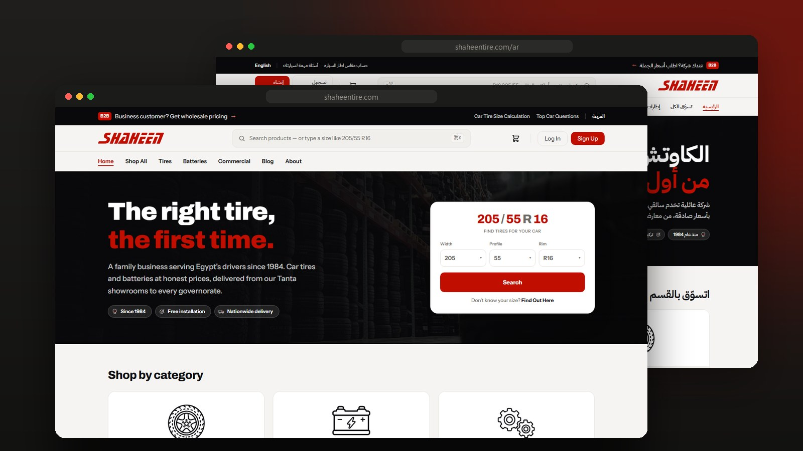
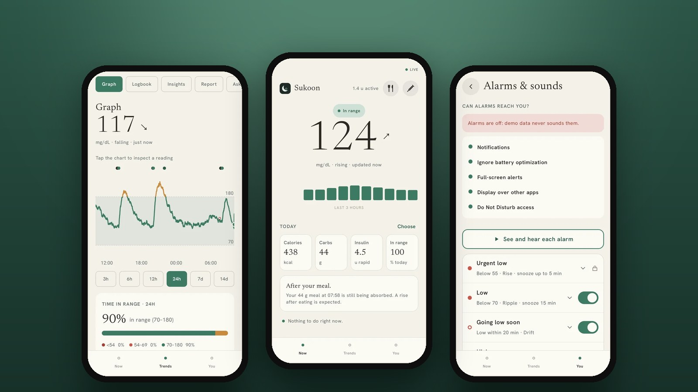
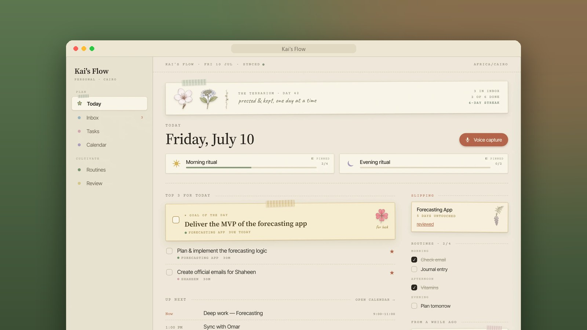
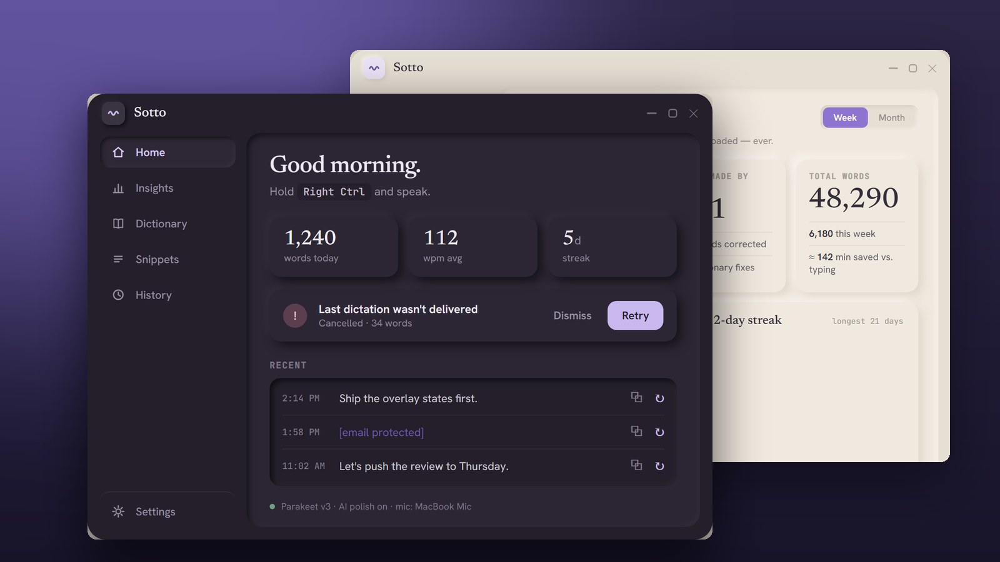

<picture>
  <source media="(prefers-color-scheme: dark)" srcset="assets/header-dark.svg">
  
</picture>

  <a href="https://khairy-kai.vercel.app"><b>Portfolio</b></a>&nbsp;&nbsp;·&nbsp;&nbsp;<a href="https://linkedin.com/in/khairy-shaheen">LinkedIn</a>&nbsp;&nbsp;·&nbsp;&nbsp;<a href="mailto:khairy.islam@shaheentire.com">Email</a>&nbsp;&nbsp;·&nbsp;&nbsp;<a href="https://wa.me/201025546572">WhatsApp</a>&nbsp;&nbsp;·&nbsp;&nbsp;<a href="https://shaheentire.com">shaheentire.com</a>

 

### Now

- **Sukoon 0.7** is out, with home-screen widgets, a long-acting insulin reminder and meals pulled in from MyFitnessPal.
- **Kai's Flow 1.0.22**, the planner I run my days on: type or say a task the way you'd say it, and it fills in the date, time and priority itself.
- **shaheentire.com** gets a new batch most days. Online card and wallet payments have been live since September, and customers can find a battery by its code.
- **At E-JUST** this term: machine learning, deep learning, computer vision and cryptography.

 

### [shaheentire.com](https://shaheentire.com)

My family's tire and battery store, live in Arabic and English. I took it over from an outside team in May 2026 and I've been its only engineer since: **1,000+ commits, 530 pull requests, 361 issues closed.** It now takes online payments, finds tires by size and batteries by code, and runs an internal platform the staff use for tasks, pricing and stock imports.

Laravel 12 · Livewire · Filament · SQLite · Paymob · Cloudflare

 

### [Sukoon](https://github.com/khairyKY/sukoon)

A calm glucose app I built for my own type 1 diabetes. It reads a FreeStyle Libre 2 sensor over Bluetooth, sounds alarms that get through Do Not Disturb, and if a low goes unanswered it texts and calls my family. In English and Egyptian Arabic, and free.

Kotlin · Jetpack Compose · Room · Supabase · 162 tests · <a href="https://github.com/khairyKY/sukoon/releases/latest">latest release</a>

 

### [Kai's Flow](https://github.com/khairyKY/kais-flow)

My whole life in one app for $0 a month: tasks, calendar, habits, journal, people and reading, synced between my laptop and phone and usable offline. I say a thought out loud and it files it in the right place.

React 19 · TypeScript · Supabase · Groq · Capacitor · 204 tests

 

### [Sotto](https://github.com/khairyKY/sotto)

Voice typing that never leaves my laptop. Hold a key and speak: a local speech model transcribes it, a local language model tidies it up, and it types into whatever app is open. Nothing goes to the cloud.

Rust · Tauri v2 · ONNX Runtime · Parakeet · llama.cpp · Vulkan

 

### How I work

I build AI-first. Claude Code writes much of the code; I decide what gets built, plan each change, read every diff and test it before it ships. That's how one person keeps a live store and three apps moving. I'm also sharpening my hand-coding underneath it.

Alongside it: UI/UX design intern at **e&** (Aug–Sep 2026) and cybersecurity intern at **Optima** (summer 2026). Before any of this, three years building custom PCs at a computer shop in Tanta.

 

<picture>
  <source media="(prefers-color-scheme: dark)" srcset="https://raw.githubusercontent.com/khairyKY/khairyKY/output/github-snake.svg">
  
</picture>

Updated October 2026

